- [Texture 란?](#texture-란)
  - [Texture type](#texture-type)
  - [PBR](#pbr)
- [texture 로드하기](#texture-로드하기)
  - [image URL 가져오기](#image-url-가져오기)
  - [image load 하기](#image-load-하기)
    - [native javascript 이용하기](#native-javascript-이용하기)
    - [TextureLoader 사용하기](#textureloader-사용하기)
    - [LoadingManager 사용하기](#loadingmanager-사용하기)
  - [전체 코드](#전체-코드)
- [UV unwrapping](#uv-unwrapping)
- [texture 변형하기](#texture-변형하기)
    - [반복](#반복)
    - [Offset](#offset)
    - [Rotation](#rotation)
- [Filtering과 MipMapping](#filtering과-mipmapping)
  - [Minification filter](#minification-filter)
  - [Magnification filter](#magnification-filter)
  - [전체 코드](#전체-코드-1)
- [Txture 형식(format) 과 최적화(optimisation)](#txture-형식format-과-최적화optimisation)
  - [무게](#무게)
  - [크기](#크기)
  - [데이터](#데이터)
- [Texture 소스를 얻을 수 있는 곳](#texture-소스를-얻을-수-있는-곳)


# Texture 란?

Texture는 geometry를 덮는 'image'입니다. 많은 texture 타입은 단지 컬러만잉 아니라, **geometry의 표면에 다양한 효과를 줄 수 있습니다.**

texture를 공부하기에 가장 일반적인 예제는 João Paulo의 [door texture](https://3dtextures.me/2019/04/16/door-wood-001/) 입니다.

## Texture type

texture 타입은 여러가지가 있지만 주로 하단의 타입들을 제일 많이 사용합니다.
``` 
    - Color
    - Alpha
    - Height
    - Normal
    - Ambient occlusion
    - Metalness
    - Roughness
```

* **Color** 또는 albedo
  
  

  > albedo(달/행성이 반사하는 태양 광선의 비율) texture는 가장 간단합니다. texture의 px을 가지며 geometry에 적용해줍니다.

* **Alpha**
  
  

  > alpha texture는 white는 visible, black은 unvisible하도록 만들어주는 흑백 이미지입니다.

* **Height**
  
  

  > height texture는 물체의 경감(미세한 물체의 높이)을 생성하기 위해 꼭짓점을 이동시키는 흑백 이미지입니다.

* **Normal**
  
  

  > normal texture는 작은 디테일을 더해주는데, 꼭짓점은 이동하지 않지만 다르게 위치해있는 물체의 면에 미세한 빛을 비춰주도록 합니다. Normal texture는 geometry를 더 잘게 나눌 필요가 없기 때문에 좋은 performance를 유지하면서 디테일을 더하는데 아주 유용합니다. 

* **Ambient occlusion**
  
  

  > ambient occlusion texture는 표면의 자잘한 틈내부에 가짜 그림자를 만들어주는 흑백 이미지입니다.

* **Metalness**
  
  

  > metalness texture는 금속부분(white), 금속이 아닌 부분(black)을 구체화해주는 흑백 이미지입니다. 이 정보는 reflection을 만드는데 도움을 줍니다.

* **Roughness**
  
  

  > roughness는 metalness와 함께 사용하는 흑백이미지이며, 거친 부분(white)과 부드러운 부분(black) 으로 나뉩니다. 이 정보는 light를 소멸시키는데 도움을 줍니다.
  >
  > 예를들어 카페트는 아주 거칠어서 반사광을 볼 수 없지만, 물읠 표면은 아주 부드러워서 반사광을 볼 수 있습니다.

## PBR

이 모든 texture들은(특별히 metalness와 roughness) **PBR 원칙** 를 따릅니다. PBR은 **물리적 기반 렌더링**입니다. 이것은 진짜같은 결과를 만들어 내기 위하여 real-life direction을 따르는 경향이 있는 많은 테크닉을 사용합니다.

다른 많은 테크닉이 있지만 PBR은 진짜같은 렌더링을 구사하기 위한 표준이 되고있습니다. - software, engines, library들이 이 테크닉을 사용중입니다.

관련 문서

* [basic theory of phisically based rendering](https://marmoset.co/posts/basic-theory-of-physically-based-rendering/)
* [phisically based rendering and you can too](https://marmoset.co/posts/physically-based-rendering-and-you-can-too/)


# texture 로드하기
## image URL 가져오기

texture를 로드하기 위해서는 이미지 파일의 URL이 필요합니다.

`/static/` 폴더 안에있는 이미지들을 `/static` 없이 간단한 URL path를 사용하여 접근할 수 있습니다. <sub>(Webpack에서만 사용가능합니다. 다른 bundler를 사용할경우 적용 안됨)</sub>

``` js
    // 1. import 시키는 방법
    import imageSource from '/image.png'

    // 2. /static 없이 가져오는 방법
    const imgSrc = '/image.png'
```

## image load 하기

### native javascript 이용하기
vanilla js 를 이용하여 image가 로드된 경우 texture를 도포하는 방법을 사용할 수 있습니다.

``` js
    // texture 생성
    const image = new Image()
    const texture = new THREE.Texture(image)
    image.addEventListener('load', () => {
        texture.needsUpdate = true
    })
    image.src = '/textures/door/color.jpg'

    // ...

    // Object
    // texture 사용
    const material = new THREE.MeshBasicMaterial({ map: texture })
```


### TextureLoader 사용하기

vanilla js 를 사용하는 테크닉도 있지만, [TextureLoader](https://threejs.org/docs/index.html#api/en/loaders/TextureLoader)를 사용하는 더 간단한 방법도 있습니다. 

``` js
    const textureLoader = new THREE.TextureLoader()
    const texture = textureLoader.load('/textures/door/color.jpg')
```

내부적으로 Three.js는 image를 로드하기 전에 준비가 되면 texture를 한번 업데이트합니다.

TextureLoader 하나의 인스턴스 만으로도 많은 texture를 호출할 수 있습니다.

``` js
    const textureLoader = new THREE.TextureLoader()
    const texture = textureLoader.load('/textures/door/.jpg')
    const alphaTexture = textureLoader.load('/textures/door/alpha.jpg')
    const heighTexture = textureLoader.load('/textures/door/height.jpg')
    const normalTexture = textureLoader.load('/textures/door/normal.jpg')
    // ....
```

`load()` 2, 3, 4 번째 매개변수는 해당 이벤트들을 호출하는 callback 함수를 받습니다.

* `load` :: image가 성공적으로 로드된 경우
* `progress` :: loading이 진행중일 때
* `error` :: 무언가 잘못된 경우

``` js
    const textureLoader = new THREE.TextureLoader()
    const texture = textureLoader.load(
        '/textures/door/color.jpg',
        () => console.log('loading finished'),     // load
        () => console.info('loading progressing'), // progress
        () => console.error('loading error')       // error
    )
```

### LoadingManager 사용하기

마지막으로, 로드할 많은 image가 있는 경우 [LoadingManater](https://threejs.org/docs/index.html#api/en/loaders/managers/LoadingManager)를 이용하여 event를 짧고 간단하게 만들 수 있습니다.

``` js
    const loadingManager = new THREE.LoadingManager()
    const textureLoader = new THREE.TextureLoader(loadingManager)
```

`onStart`, `onLoad`, `onProgress`, `onError` 메서드를 사용하여 event를 추적할 수  있습니다.

``` js

    const loadingManager = new THREE.LoadingManager()
    loadingManager.onStart = () => console.log('onStart')
    loadingManager.onProgress = () => console.log('onProgress')
    loadingManager.onLoad = () => console.log('onLoad')
    loadingManager.onError = () => console.log('onError')
    const textureLoader = new THREE.TextureLoader(loadingManager)
```

이제 원하는 모든 image를 한꺼번에 로드한 후 실행시킬 수 있습니다.

## 전체 코드

``` js

    /**
     * 🧨 Texture
     */

    const loadingManager = new THREE.LoadingManager()

    loadingManager.onStart = () => console.log('onStart')
    loadingManager.onProgress = () => console.log('onProgress') // texture가 총 6개 - 6 번 호출!
    loadingManager.onLoad = () => console.log('onLoad')
    loadingManager.onError = () => console.log('onError')

    const textureLoader = new THREE.TextureLoader(loadingManager)
    const colorTexture = textureLoader.load(imgSrc)
    const alphaTexture = textureLoader.load('/textures/door/alpha.jpg')
    const heighTexture = textureLoader.load('/textures/door/height.jpg')
    const normalTexture = textureLoader.load('/textures/door/normal.jpg')
    const ambientOcclusionTexture = textureLoader.load('/textures/door/ambientOcclusion.jpg')
    const metalnessTexture = textureLoader.load('/textures/door/metalness.jpg')
    const roughnessTexture = textureLoader.load('/textures/door/roughness.jpg')

    // Base...
    // Canvas...
    // Scene...

    /**
     * Object
     */
    const geometry = new THREE.BoxGeometry(1, 1, 1)
    const material = new THREE.MeshBasicMaterial({ map: colorTexture }) // 🎈
    const mesh = new THREE.Mesh(geometry, material)
    scene.add(mesh)
    
    // ...
```

# UV unwrapping


object에(특히 복잡한 object) texture를 입히는것은 다소 까다롭습니다. 
>   ex. SphereGeometry, ConeGeometry, TorusGeometry ....

이런경우 texture는 늘어나고 다른방식으로 geometry를 감싸기 위해서 비틀어집니다. 이것을 **UV unwrapping** 이라고 하는데, texture가 활짝 펴진 전개도라고 생각하면 쉽습니다.

간단한 object는 `geometry.attributes.uv` 프로퍼티를 이용하여 UV 2D 조직(UV 전개도)을 볼 수 있습니다.

``` js
    console.log(geometry.attributes.uv)
```


그러나 복잡한/직접 제작한 geometry에 texture를 입히고 싶을 경우에는 특별한 UV 전개도가 필요합니다.

# texture 변형하기

### 반복

texture를 `repeat` 프로퍼티를 이용하여 반복시킬 수 있습니다. `x` `y` 프로퍼티를 가지는 [Vector2](https://threejs.org/docs/index.html#api/en/math/Vector2) 를 이용합니다.

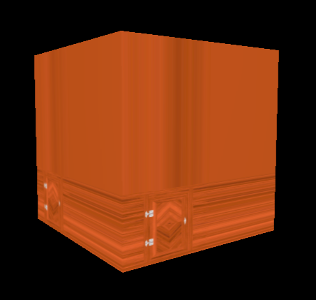

``` js
    const colorTexture = textureLoader.load('/textures/door/color.jpg')

    // transform
    colorTexture.repeat.x = 2
    colorTexture.repeat.y = 3
```

이미지와 같이 texture는 작지만 repeat하지 않고, pixel이 늘어난것 처럼 보입니다.

기본적으로 repeat 하지 않도록 설정되어있어서 그렇습니다. 이것을 변경하기 위해서는 `THREE.RepeatWrapping` constant 를 사용하여 `wrapS` (x 축)와 `wrapT` (y 축) 프로퍼티를 업데이트 합니다. 


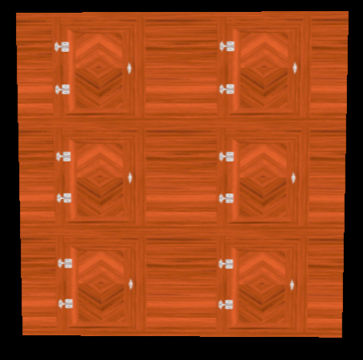


``` js
    // transform
    colorTexture.WrapS = THREE.RepeatWrapping
    colorTexture.WrapT = THREE.RepeatWrapping
```

거울처럼 마주보게 방향을 바꿀 수도 있습니다.

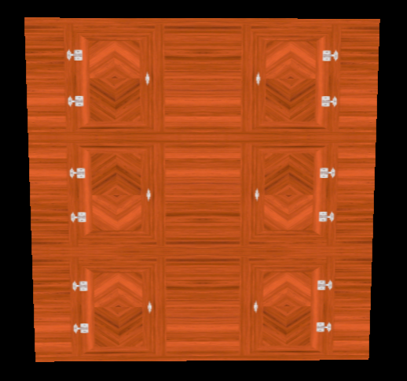

``` js
    colorTexture.wrapS = THREE.MirroredRepeatWrapping
    colorTexture.wrapT = THREE.MirroredRepeatWrapping
```

### Offset

[Vector2](https://threejs.org/docs/index.html#api/en/math/Vector2)의 `x` `y` 프로퍼티를 포함한 `offset` 프로퍼티를 이용하여 texture를 오프셋 할 수도 있습니다.


``` js
    colorTexture.offset.x = 0.5
    colorTexture.offset.y = 0.5
```

### Rotation

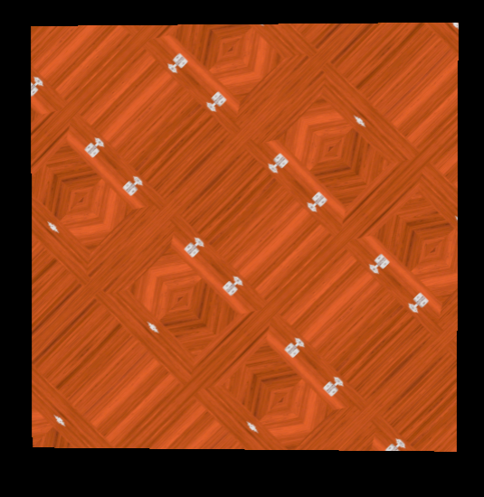

`rotation` 프로퍼티를 사용해서 texture를 회전할 수도 있습니다.

``` js
    colorTexture.rotation = Math.PI * 0.25
```

`offset`과 `repeat` 프로퍼티를 제거하면, rotation은 bottom, left 모서리 주변을 감싼다는 것 을 볼 수 있는데,

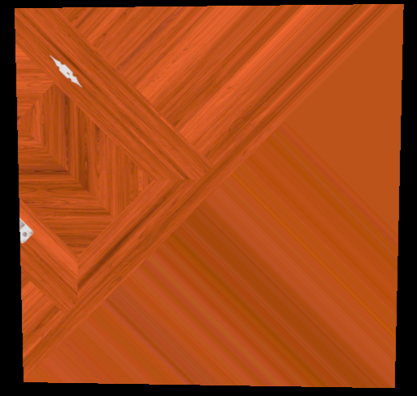


rotation의 중심점(pivot)을 변경하고 싶다면, Vector2 에서 제공하는 `center` property를 사용할 수 있습니다.

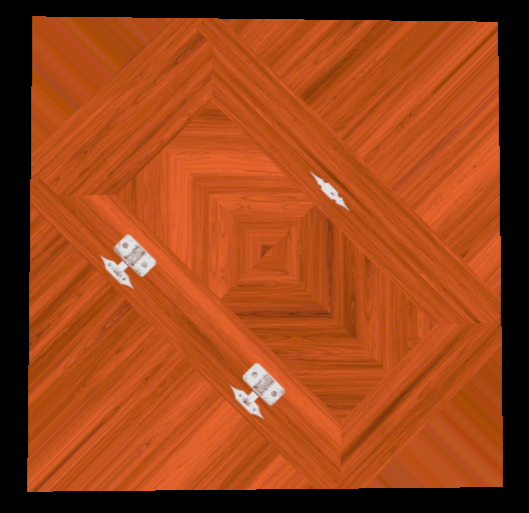

``` js
    // offset, repeat 제거
    colorTexture.rotation = Math.PI * 0.25
    colorTexture.center.x = 0.5
    colorTexture.center.y = 0.5
```

# Filtering과 MipMapping


cube의 상단 모서리면은 거의 가려져있지만 아주 흐릿한 texture를 볼 수있습니다. 이것은 filtering과 MIP mapping 때문입니다.

Mip mapping은 1x1 texture가 나올 때까지 연속적으로 더 작은 버전을 만드는 기술입니다. 이 모든 다양한 texture들은 GPU에 보내지고, GPU는 가장 적절한 버전의 texture를 선택할것 입니다.

Three.js와 GPU는 이미 이 모든것을 처리 하고있어서, 어떤 filter 알고리즘을 사용할 것인지 설정하기만 하면 됩니다. minification filter와 magnification filter 두가지 알고리즘이 있습니다.

## Minification filter

minification filter는 **texture의 pixel이 render하는 pixel 보다 더 작을때 발생**합니다. 다른말로, texture가 오브젝트의 표면보다 너무 큰 경우입니다.

`minFilter` 프로퍼티를 이용하여 texture의 minification filter를 변경할 수 있습니다.

설정 가능한 6개의 값들이 있습니다.

* `THREE.LinearFilter`
* `THREE.NearestFilter`
* `THREE.NearestMipmapNearestFilter`
* `THREE.NearestMipmapLinearFilter`
* `THREE.LinearMipmapNearestFilter`
* `THREE.LinearMipmapLinearFilter` - default


``` js
  colorTexture.minFilter = THREE.NearestFilter
```

기본으로 설정되어있는 값이 마음에 들지 않을경우, 다른 filter들을 사용할 수 있습니다.

보이는 texture는  moiré patterns 라고 불리며, 보통 피하고싶어하는 현상입니다.

<div style="overflow: hidden">
  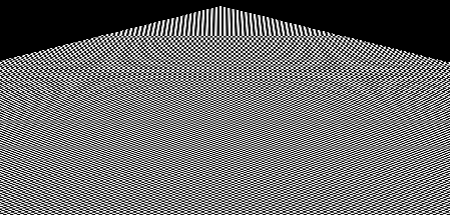
  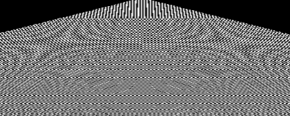
  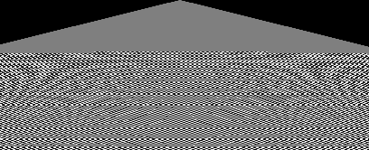
  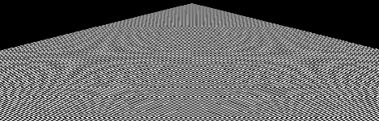
  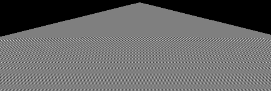
  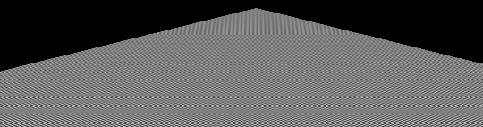
</div>


## Magnification filter

Maginfication filter는 minification filter랑 비슷하지만 **render pixel보다 texture pixel이 더 크다는 것** 입니다. 다른말로, texture가 오브젝트의 표면 크기보다 너무 작을 경우입니다.


 보여지는 텍스쳐는 오브젝트의 표면 크기보다 작은 texxture 때문에 이미지가 늘어나 경계가 뚜렷하지않습니다.


texture의 magnification filter를 변경하기 위해선 `magFilter` 프로퍼티를 이용해야합니다.

설정 가능한 2 개의 값이 있습니다.

* `THREE.NearestFilter`
* `THREE.LinearFilter` - default

``` js
  colorTexture.magFilter = THREE.NearestFilter
```


이 모든 filter들에 관하여 덧붙이자면, `THREE.NearestFilter` 가 다른 filter 들 보다 더 가볍습니다. 사용할 때는 더 나은 퍼포먼스를 고려해야합니다.

**mipmap을 `minFilter` 프로퍼티를 위해서만 사용하세요.** `THREE.NearestFilter`를 사용할 경우, mipmap은 필요하지않으므로 `generateMipmaps` 프로퍼티를 `false` 로 비활성화 시킬 수 있습니다. 해당 작업은 GPU 작업을 가볍게 만들어줍니다.

``` js
  colorTexture.generateMipmaps = false
  colorTexture.minFilter = THREE.NearestFilter
```

**적당한 텍스쳐 크기를 설정해야 퍼포먼스에 좋은 영향을 준다는 것을 잊지마세요!!**

## 전체 코드
``` js
  
/**
 * 🧨 Texture
 */

// loadingManager ...

const textureLoader = new THREE.TextureLoader(loadingManager)
const colorTexture = textureLoader.load(imgSrc)

// texture setting ...

colorTexture.generateMipmaps = false
colorTexture.minFilter = THREE.LinearFilter

colorTexture.magFilter = THREE.NearestFilter

// ...
```

# Txture 형식(format) 과 최적화(optimisation)

texture를 준비할 때, 가장 중요하게 생각해야할 3 가지가 있습니다.

* 무게 - weight
* 크기 - size / resolution
* 데이터 - data

## 무게

제작된 웹사이트를 방문할 사용자는 해당 texture를 다운로드 받습니다. 웹에서는 `.jpg` (조금 손상되었지만 가볍습니다) 나 `.png` (손상은 없지만 보통 무겁습니다) 를 많이 사용합니다.

가능한한 가벼우면서 허용가능한 이미지를 사용하도록 합니다. [TinyPNG](https://tinypng.com/) 같은 웹사이트를 이용하여 이미지를 압축해서 사용합니다.

## 크기

texture의 각 pixel은 이미지의 무게와 상관 없이 GPU에 저장됩니다. 하드드라이브 처럼, GPU는 저장공간에 제한이 있습니다. 자동으로 생성된 mip mapping 이 저장되어야 하는 pixel의 크기를 증가시키기 때문에 더 느려질 수도 있습니다.

**가능한한 이미지의 크기를 줄여서 사용해야합니다.**

상단의 mip mapping에서 설명했다시피, Three.js 는 1x1 이 될 때까지 계속해서 더 작은 사이즈의 texture를 생성합니다. 이 때문에, texture의 width, height는 제곱이어야 합니다. Three.js가 texture를 2로 나누기 때문에 해당 사항은 필수적입니다.
> ex) `512x512`, `1024x1024`, `512x2048`
> 
> `512`, `1024`, `2048` 은 1 이 될 때까지 2로 나눌 수 있습니다.

만약 width나 height 가 제곱 값과는 다르다면 Three.js는 제곱값과 비슷하도록 값을 늘리므로, 비주얼적으로 좋지않은 결과가 나오며, console에 warning을 얻게될 수도 있습니다.

## 데이터

아직 테스트해보진 않았지만, texture도 투명도를 지원합니다. jpg 파일이 알파 채널을 가지고있지 않기 때문에 png를 사용하는것이 더 선호됩니다. (또는 다음 레슨에서 alpha map  을 사용할 수 있습니다) 

normal texture 를 사용한다면 각각의 pixel의 red, green, blue 채널의 정확한 값이 필요할 수 있습니다. 그럴 경우, 손상없는 파일이 값을 유지시켜줄 수 있기 때문에 png 파일이 필요합니다.

# Texture 소스를 얻을 수 있는 곳

완벽한 texture를 찾는것은 어렵지만, 제공하는 웹 사이트들이 많습니다.

* poliigon.com
* 3dtextures.me
* arroway-textures.ch

포토샵같은 2D 소프트웨어로 직접 texture를 만들 수도 있고, [Substance Designer](https://www.substance3d.com/products/substance-designer/) 과 같은 소프트웨어로 더 진짜같은 texture를 만들 수도 있습니다.
