# Lights

Light 를 넣는 일은 간단합니다. 적절한 class 를 사용하여 인스턴스를 만들고 `scene` 에 추가하면 됩니다.

Light에도 여러 타입이 있습니다.

# Setup

light 를 사용할 것 이기 때문에, light 에 반응하는 material 을 사용해야합니다. 여기서는 가장 진짜 같은 [MeshStandardMaterial](https://threejs.org/docs/index.html#api/en/materials/MeshStandardMaterial) 을 사용할 것 입니다. 

# AmbientLight

[AmbientLight](https://threejs.org/docs/index.html#api/en/lights/AmbientLight)는 전방향의 light를 scene의 모든 geometry에 적용합니다. 매개변수는 `color` 와 `intensity` 입니다. material 을 위해서는, property를 직접적으로 세팅해줍니다.

``` js
  const ambientLight = new THREE.AmbientLight(0xffffff, 0.5)
  scene.add(ambientLight)
```

모든 geometry에 동일하게 비춰지기 때문에 [AmbientLight](https://threejs.org/docs/index.html#api/en/lights/AmbientLight) 는 [MeshBasicMaterial](https://threejs.org/docs/index.html#api/en/materials/MeshBasicMaterial) 과 같은 효과를 낸다는 것을 확인할 수 있습니다.

실제로 물체에 빛을 비출경우, 반대편에 빛이 들어오면 object의 옆면은 완전히 검정색은 아닙니다. 빛이 벽이나 다른 물체들에 의해서 반사되기 때문입니다. 빛 반사는 Three.js 에서 퍼포먼스 문제로 지원하지 않지만, 얕은 AmbientLight 를 사용하여 존재하는척 만들 수 있습니다.

# DirectionalLight

[DirectionalLight](https://threejs.org/docs/index.html#api/en/lights/DirectionalLight) 는 태양광이 비추는 태양과 같은효과를 냅니다. 매개변수는 `color`, `intensity` 를 가지고 있습니다.

``` js
  // 🧨 DirectionalLight
  const directionalLight = new THREE.DirectionalLight(0x0ffffc, 0.3)
  directionalLight.position.set(1, 0.25, 0)

  scene.add(directionalLight)
```

기본적으로, light 는 위에서 오는것 처럼 보이므로, 전체 light 를 `position` 프로퍼티를 이용하여 전체 light 를 움직입니다.

<div style="float:left; overflow: hidden">
  
  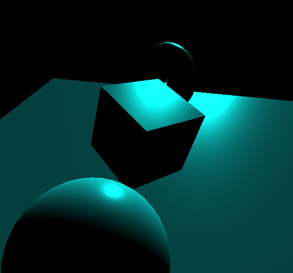
</div>

# HemisphereLight

[HemisphereLight](https://threejs.org/docs/index.html#api/en/lights/HemisphereLight) 는 AmbientLight 와 유사하지만, HemisphereLight 하늘에서, 땅에서 오는 색상 두가지를 가지고있는 것이 특징입니다.

* 첫 번째 매개변수는 sky color - `color` 이며,
* 두 번째 매개변수는 ground color - `groundColor`,
* 세 번째 매개변수는 `intensty` 입니다.

```js
  // 🧨 HemisphereLight
  const hemisphereLight = new THREE.HemisphereLight(0xff0000, 0x0000ff, 0.3)

  scene.add(hemisphereLight)
```
<div style="float:left; overflow: hidden">
  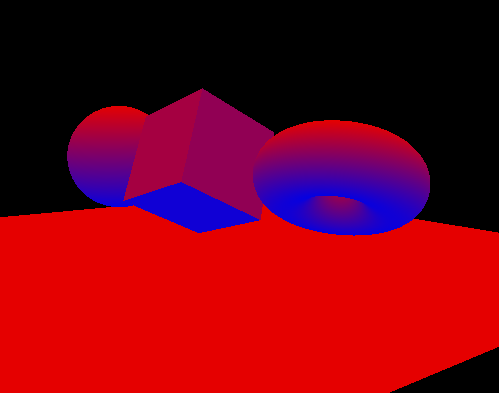
  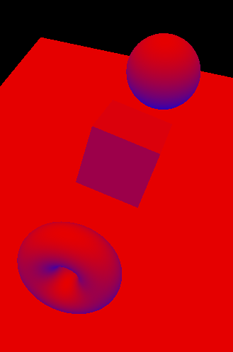
  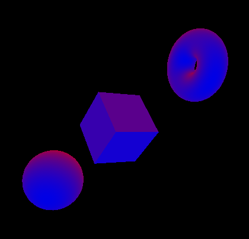
</div>

# PointLight

[PointLight](https://threejs.org/docs/index.html#api/en/lights/PointLight) 는 거의 라이터랑 비슷합니다. light 요소는 굉장히 작고, 빛은 일정하게, 모든 방향으로 뻗어나갑니다. `color`, `intensity`, `distance`, `decay` 매개변수를 받습니다.

기본적으로, light 의 강도 (`intensity`)는 희미하지 않지만, `distance` 와 `decay` 프로퍼티를 사용하여 fade 를 설정할 수 있습니다.

``` js
  // 🧨 PointLight
  const pointLight = new THREE.PointLight(0xffff00, 0.9, 3)
  pointLight.position.set(1, -0.5, 1)

  scene.add(pointLight)
```

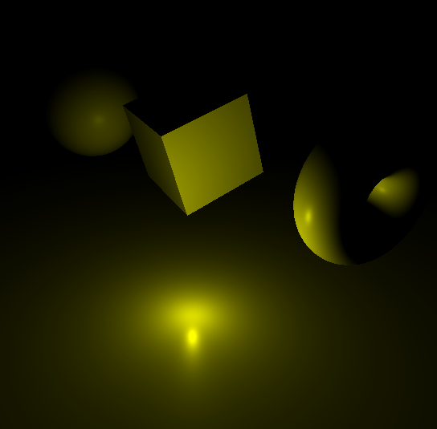

# RectAreaLight

[RectAreaLight](https://threejs.org/docs/index.html#api/en/lights/RectAreaLight) 는 사진관에서 볼 수 있는 큰 네모 모양의 light 입니다. directional light 와 diffuse light 를 혼합한 것 입니다. `color`, `intensity`, 네모의 `width`, `height` 매개변수를 받습니다.

``` js
  // 🧨 RectAreaLight
  const rectAreaLight = new THREE.RectAreaLight(0x4e00ff, 2, 2, 1)
  rectAreaLight.position.set(-1.5, 0, 1.5)
  rectAreaLight.lookAt(new THREE.Vector3()) // 0, 0, 0 ==> center

  scene.add(rectAreaLight)
```

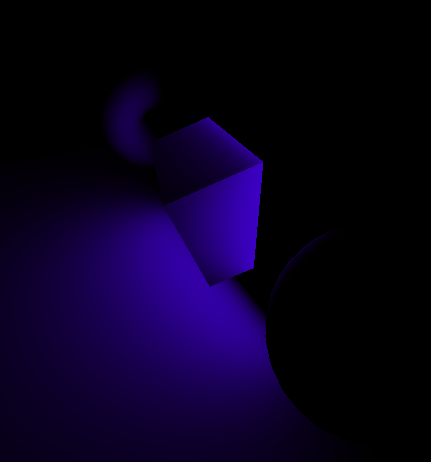

RectAreaLight 는 [MeshStandardMaterial](https://threejs.org/docs/#api/en/materials/MeshStandardMaterial) 와 [MeshPhysicalMaterial](https://threejs.org/docs/#api/en/materials/MeshPhysicalMaterial) 에만 적용됩니다.

light 를 움직일수도, 회전시킬 수도 있습니다. rotation 을 쉽게 하기위해서, `lookAt()` 메서드를 사용합니다.

[Vector3](https://threejs.org/docs/index.html#api/en/math/Vector3) 는 매개변수를 `x`, `y`, `z` 순으로 받으며, `0` 또는 매개변수를 넘기지 않으면 기본적으로 `center` 에 위치합니다.

# SpotLight

[SpotLight](https://threejs.org/docs/index.html#api/en/lights/SpotLight) 는 특정 포인트에서 설정된 방향을 향해 강한 원뿔 형태의 빛을 비춰줍니다. 매개변수로는, 

* `color`: 색상
* `intensity`: 강도
* `distance` : (강도가 0 까지 떨어지는) 거리
* `angle`: beam 의 크기 (원의 너비)
* `penumbra`: beam 의 윤곽선이 얼마나 뿌옇게 될지 설정
* `decay`: 밝기

``` js
  // 🧨 SpotLight
  // ...
  
  spotLight.target.position.x = -1
  scene.add(spotLight.target)
```

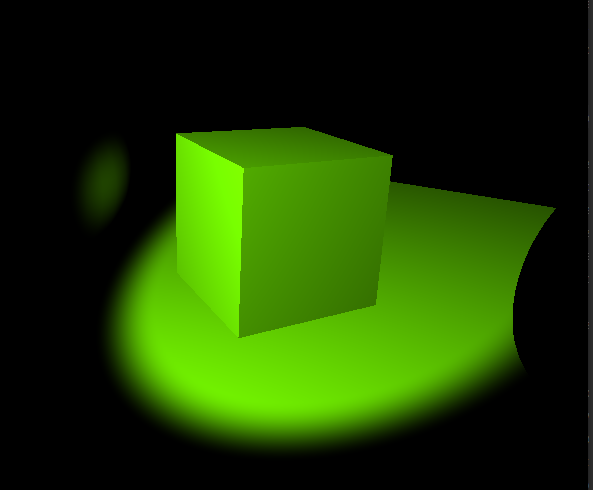
  
``` js
  const spotLight = new THREE.SpotLight(0x78ff00, 0.5, 10, Math.PI * 0.1, 0.25, 1)
  spotLight.position.set(0, 2, 3)
  scene.add(spotLight)
```

SpotLight 를 rotate 하는건 조금 어렵습니다. 해당 인스턴스는 [Object3D](https://threejs.org/docs/index.html#api/en/core/Object3D) 형태인 `target` 이라는 프로퍼티를 갖습니다. SpotLight 는 항상 `target` object를 바라보고 (looking at) 있습니다. 그러나 이 position 을 이동시킬경우, SpotLight 는 꼼짝도 하지 않을 것 입니다.


`target` 이 `scene` 에 추가되지 않았기 때문입니다. 간단하게 `target` 을 scene 에 추가하면 동작합니다.

  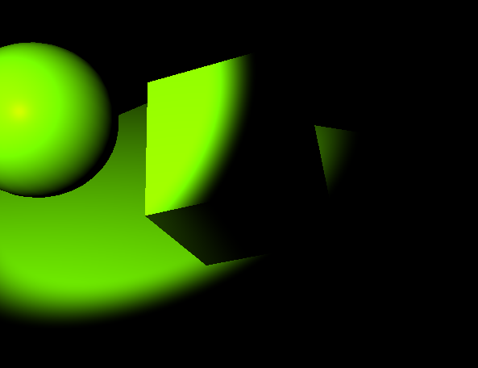

# Performance

Light 는 잘 사용되면 진짜같고, 멋진 요소입니다. 문제는 light 는 퍼포먼스에서 메모리를 많이 소모합니다. 빛의 거리, 얼만큼 빛이 들어오는지, spot light 의 원뿔형이 얼마나 큰지... 등... GPU 는 계산을 많이 해야합니다.

가능한한 적은 갯수의, 적은 비용의 light 를 사용하세요

| Minimal cost    | Moderate cost    | High cost     |
| --------------- | ---------------- | ------------- |
| AmbientLight    | DirectionalLight | SpotLight     |
| HemisphereLight | PointLight       | RectAreaLight |

# Baking

light 를 사용하는 좋은 테크닉은 baking 을 하는 것 입니다.
이 아이디어는 light 를 texture에 bake 하는 것 입니다. 이건 3D software 에서 가능합니다. 안타깝게도 많은 texture 들을 필요로 하기 때문에 light 를 움직여 결과를 볼 수는 없습니다.


# Helpers

light 의 위치와 방향을 설정하는것은 어렵습니다. 이것을 돕기위해 helper 가 필요합니다. 

* [HemisphereLightHelper](https://threejs.org/docs/index.html#api/en/helpers/HemisphereLightHelper)
* [DirectionalLightHelper](https://threejs.org/docs/index.html#api/en/helpers/DirectionalLightHelper)
* [PointLightHelper](https://threejs.org/docs/index.html#api/en/helpers/PointLightHelper)
* [RectAreaLightHelper](https://threejs.org/docs/index.html#examples/en/helpers/RectAreaLightHelper)
* [SpotLightHelper](https://threejs.org/docs/index.html#api/en/helpers/SpotLightHelper)

사용하기 위해선, 간단하게 해당 클래스들을 인스턴스화 시켜주면 됩니다. 첫 번째 매개변수로 선언한 light 들을 받고, 두번째 매개변수는  helper 의 `size` 입니다. 그리고 scene 에 추가하면 됩니다.

``` js
  /**
   * 🎈 Light Helpers
   */
  const hemisphereLightHelper = new THREE.HemisphereLightHelper(hemisphereLight, 0.2)
  scene.add(hemisphereLightHelper)

  const directionalLightHelper = new THREE.DirectionalLightHelper(directionalLight, 0.5)
  scene.add(directionalLightHelper)

  const pointLightHelper = new THREE.PointLightHelper(pointLight, 0.2)
  scene.add(pointLightHelper)
```


<div style="float:left; overflow: hidden">
  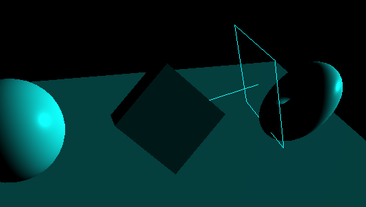
  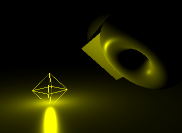
</div>

SpotLightHelper 는 `size` 매개변수가 없으며, target 을 움직인 후, 다음 frame 에서 `update()` 메서드를 호출해야합니다.

``` js
  const spotLightHelper = new THREE.SpotLightHelper(spotLight)
  scene.add(spotLightHelper)
  window.requestAnimationFrame(() => {
      spotLightHelper.update()
  })
```

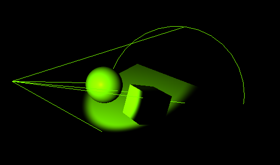

RectAreaLightHelper 는 더 사용하기 어렵습니다. 지금은 해당 클래스가 `THREE` 변수에 일부가 아니므로 `examples` dependency를 이용하여 상단에 `import` 시켜줍니다.

``` js
  import { RectAreaLightHelper } from 'three/examples/jsm/helpers/RectAreaLightHelper.js'
```

그 후에 사용할 수 있습니다.

``` js
  const rectAreaLightHelper = new RectAreaLightHelper(rectAreaLight)
  scene.add(rectAreaLightHelper)
```

  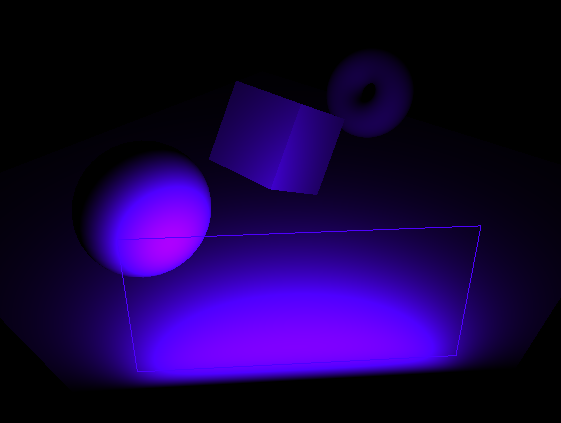
