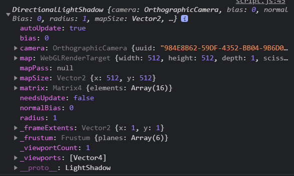
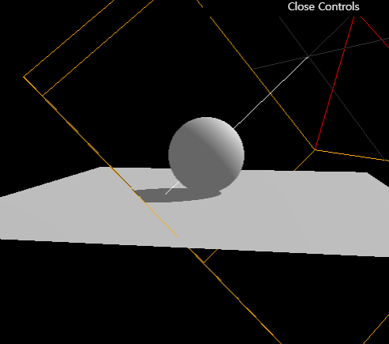
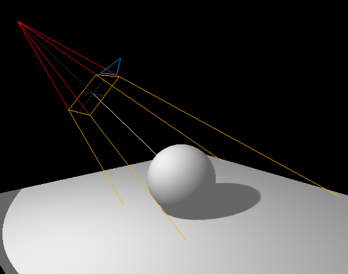
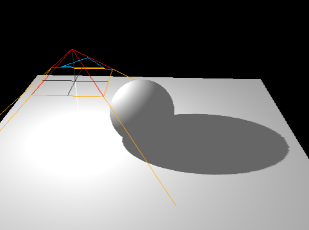

- [Shadows](#shadows)
- [How it works](#how-it-works)
- [Setup](#setup)
- [How to activate shadows](#how-to-activate-shadows)
- [Shadow map optimaizations](#shadow-map-optimaizations)
  - [Render Size](#render-size)
  - [Near and Far](#near-and-far)
  - [Amplitude](#amplitude)
  - [Blur](#blur)
- [Shadow map algorithm](#shadow-map-algorithm)
- [SpotLight](#spotlight)
- [PointLight](#pointlight)
- [Baking Shadows](#baking-shadows)
- [Baking shadows alternative](#baking-shadows-alternative)
- [Which technique to use](#which-technique-to-use)

# Shadows

지난 강의에서 light를 만들었으므로, 그림자(shadow) 가 필요합니다. object의 뒷부분은 **core shadow** 라고 불리며, 이미 어둡습니다. 여기에서는 object가 또다른 object 위에 그림자를 만들어내는 **drop shadow**가 빠져있습니다.

그림자는 real-time 3D rendering 에서는 매우 어려운 부분이고, 개발자들은 진짜같은 그맂마들을 합리적인 frame 속도로 보여주는 트릭을 찾아내야 합니다.

그림자를 구현해내는 방법은 많고, Three.js 는 내장 솔루션이 있습니다. 이 해결법은 간편하지만 완벽하다고 하기엔 문제가 있습니다.

# How it works

어떻게 그림자가 내부적으로 작동하는지에 대해서보다는, 기초를 이해해야 합니다.

일단 하나를 랜더링 하면, Three.js 는 그림자를 만들어내는 각각의 light 를 위하여 render를 실행합니다. 이 render 행위는 light가 마치 camera 가 화면을 보는 것 같이 행동합니다. (light 가 비추는 빛이 camera scene 인 것 처럼 행동합니다) 이 light 가 render 되는 동안, [MeshDepthMaterial](https://threejs.org/docs/index.html#api/en/materials/MeshDepthMaterial) 는 모든 light camera에 보여지는 mesh 의 material 을 대체합니다.

이 결과는 texture 로 저장되고 shadow map 이라고 불립니다.

이 shadow map 들을 직접적으로 볼 수는 없지만, 그림자를 받는 모든 geometry의 모든 material 에 도포됩니다.

[DirectionalLight 와 SpotLight Three.js 예제](https://threejs.org/examples/webgl_shadowmap_viewer.html)


# Setup

시작 파일에서는 간단한 plane에 sphere 하나와 하나의 directional light 와 ambient light 로 이루어져있습니다.

light  와 material metalness, roughness 를 조절할 수 있습니다.


# How to activate shadows

`renderer` 에 shadow map 을 활성화 시켜야합니다.

``` js
  /**
  * Renderer
  */
  // ...

  // 🧊
  renderer.shadowMap.enabled = true
```

그리고 scene의 각각의 obect 를 확인하고 `castShadow` 프로퍼티를 사용하여 **object가 그림자를 만들어 낼 수 있어야 하는지**에 대해서 결정합니다. **object가 그림자를 받는다면** `receiveShadow` 프로퍼티를 추가해야합니다.

``` js
  /**
  * Objects
  */
  // sphere ...
  sphere.castShadow = true

  // plane ...
  plane.receiveShadow = true
```

마지막으로 `castShadow` 프로퍼티를 사용하여 그림자를 light 에 활성화 시켜줍니다.

아래 타입의 light 가 shadow 를 지원합니다.

* [PointLight](https://threejs.org/docs/index.html#api/en/lights/PointLight)
* [DirectionalLight](https://threejs.org/docs/index.html#api/en/lights/DirectionalLight)
* [SpotLight](https://threejs.org/docs/index.html#api/en/lights/SpotLight)

그리고 shadow를 가능한한 작은 light 빛에 그림자를 활성화 시켜줍니다.

``` js
  
  /**
  * Lights
  */
  // Ambient light...
  // Directional light...
  directionalLight.castShadow = true
```


이제 plane 과 sphere 에 그림자를 갖게 되었습니다. 그러나 그림자가 좋아보이지 않으므로 개선시켜야합니다.

# Shadow map optimaizations

## Render Size

강의의 시작부분에서, Three.js 는 각각의 light 마다 shadow map 을 호출하며 render를 한다고 했습니다. 이 shadow map (그리고 그 외의 것들) 에 `shadow` 프로퍼티를 사용해 접근할 수 있습니다.

``` js
  console.log(directionalLight.shadow)
```



render를 위해서는 size 를 구체화 시켜야합니다. 기본적으로는 shadow map size는  퍼포먼스 문제로 인하여 `512 * 512`  입니다. 개선할 순 있지만 mipmapping을 위해서 2배로 늘릴 필요가 있습니다.

``` js
  directionalLight.shadow.mapSize.width = 1024
  directionalLight.shadow.mapSize.height = 1024
```


그림자는 이제 조금 나아졌습니다.

## Near and Far

Three.js 는 shadow map 랜더링을 위해서 (light)camera를 사용합니다. 이 (light)camera는 camera 와 같은 프로퍼티 를 가지고 있습니다. 이것은 `near` 과 `far` 프로퍼티를 정의해야한다는 것을 의미합니다. 이것은 그림자의 퀄리티를 개선시키진 않지만, 설정했으나 그림자가 보이지 않는다거나, 어디선가 그림자가 갑자기 잘려보이는 등의 버그를 수정할 수 있습니다.

*(light)* camera 디버깅과 `near`, `far` 를 보기 위해서는, shadow map 에 사용된 *(light)* camera 에  [CameraHelper](https://threejs.org/docs/#api/en/helpers/CameraHelper) 를 사용할 수 있습니다. (*light* camera 는 `directionalLight.shadow.camera` 에 정의되어있습니다)


``` js
  // 💎
  const directionalLightCameraHelper = new THREE.CameraHelper(directionalLight.shadow.camera)
  // directionalLightCameraHelper.visible = false

  scene.add(directionalLightCameraHelper)
```


이제 light camera 의 `near` 과 `far` 를 볼 수 있습니다. scene 에 맞는 값을 찾으려고 해보세요.

``` js
  directionalLight.shadow.camera.near = 1
  directionalLight.shadow.camera.far = 6
```


## Amplitude

우리가 추가한 camera helper 덕분에, 우리는 camera 의 너비가 너무 크다는것을 알 수 있었습니다.

[DirectionalLight](https://threejs.org/docs/#api/en/lights/DirectionalLight) 를 사용하기 때문에, Three.js는 [OrthographicCamera](https://threejs.org/docs/#api/en/cameras/OrthographicCamera) 를 사용합니다. 지난 07 Camera 강의를 기억한다면, `top`, `right`, `bottom`, `left` 프로퍼티를 시용해서 각각의 camera 의 각 측면을 얼만큼 멀리할지 설정할 수 있습니다.

``` js
  directionalLight.shadow.camera.top = 2
  directionalLight.shadow.camera.right = 2
  directionalLight.shadow.camera.bottom = - 2
  directionalLight.shadow.camera.left = - 2
```


더 작은 값과 더 정확한 그림자가 될 것 입니다. 그러나 너무 작으면, 그림자가 잘릴 수 도 있으므로 많은 실험을 하는게 좋습니다.



완성된 후에는 camera 를 hide 시킬 수 있습니다.

``` js
  directionalLightCameraHelper.visible = false
```


## Blur

그림자의 blur 를 조절 할 수 있습니다.

``` js
  directionalLight.shadow.radius = 10
```

이 테크닉은 카메라의 근거리를 사용하지 않습니다. 그냥 간단한 블러를 생성해주므로 보기가 좋지는 않습니다.


# Shadow map algorithm

shadow map 에는 다른 타입의 알고리즘이 사용됩니다.

| Algorithm                  | Performance | quality                                |
| -------------------------- | ----------- | -------------------------------------- |
| **THREE.BasicShadowMap**   | 매우 빠름   | 좋지 않음                              |
| **THREE.PCFShadowMap**     | 좋지 않음   | 부드러운 모서리를 가짐                 |
| **THREE.PCFSoftShadowMap** | 좋지 않음   | 더 부드러운 모서리를 가짐              |
| **THREE.VSMShadowMap**     | 좋지 않음   | 가장 제약적으고 예상치못한 결과를 보유 |

Shadow map 을 변경하기 위해서는 `renderer.shadowMap.type` 프로퍼티가 필요합니다. 기본은 `THREE.PCFShadowMap` 이지만, 더 좋은 퀄리티를 위해서 `THREE.PCFSoftShadowMap` 을 사용할 것 입니다.

``` js
  // 🧊
  renderer.shadowMap.enabled = true
  renderer.shadowMap.type = THREE.PCFSoftShadowMap
```


radius 프로퍼티는 `THREE.PCFSoftShadowMap` 에서 동작하지 않는다는것을 염두해야하므로, 선택을 해야합니다.

# SpotLight

이전 강의처럼 SpotLight 를 추가하여 `castShadow` 프로퍼티를 `true` 로 만듭니다. `target` 프로퍼티도 `scene` 에 추가 하는 것 잊지 마세요.

``` js
  // 🎇 SpotLight
  const spotLight = new THREE.SpotLight(0xffffff, 0.2, 10, Math.PI * 0.3)
  spotLight.position.set(0, 2, 2)

  spotLight.castShadow = true

  scene.add(spotLight)
  scene.add(spotLight.target)

  const spotLightCameraHelper = new THREE.CameraHelper(spotLight.shadow.camera)
  scene.add(spotLightCameraHelper)
```

그림자 퀄리티를 향상시키는 방법은 directional light 에서 사용했던 테크닉을 사용하는 것입니다. `shadow.mapSize` 를 변경하세요

``` js
  spotLight.shadow.mapSize.width = 1024
  spotLight.shadow.mapSize.height = 1024
```

[SpotLight](https://threejs.org/docs/index.html#api/en/lights/SpotLight) 를 사용하기 때문에, 내부적으로 Three.js 는 [PerspectiveCamera](https://threejs.org/docs/index.html#api/en/cameras/PerspectiveCamera) 를 사용합니다. 이것은  fov 프로퍼티 (`top`, `right`, `bottom`, `left` 프로퍼티를 대신) 를 변경해야한다는 의미입니다.
그림자가 잘리지 않는 한에서 가능한한 적은 각도를 찾아야합니다.

``` js
  spotLight.shadow.camera.fov = 30
  spotLight.shadow.camera.near = 1
  spotLight.shadow.camera.far = 6
```




# PointLight

그림자를 지원하는 마지막 클래스는, [PointLight](https://threejs.org/docs/index.html#api/en/lights/PointLight) 입니다.

``` js
  // 🎇 PointLight
  const pointLight = new THREE.PointLight(0xffffff, 0.3)
  pointLight.position.set(-1, 1, 0)

  pointLight.castShadow = true

  scene.add(pointLight)

  // point light 는 여러군데에서 shadow 를발생시킬 수 있음
  const pointLightCameraHelper = new THREE.CameraHelper(pointLight.shadow.camera)
  scene.add(pointLightCameraHelper)
```



보시다시피, camera helper는 SpotLight 처럼 [PerspectiveCamera](https://threejs.org/docs/index.html#api/en/cameras/PerspectiveCamera) 이지만, 아래를 향해있습니다. 이것은 Three.js 가 PointLight 를 위한 shadow map 을 핸들링하기 때문입니다.

point light 가 모든 방향(360도)을 비추기 때문에, Three.js 는 cube shadow map 을 생성하기 위해서 각각의 6 방향을 랜더링 해야합니다. 보이는 camera helper는 마지막 (바닥을 향하는) 랜더링이 된 카메라의 포지션입니다.

이 모든 랜더링을 하는것은 퍼포먼스 문제가 발생할 수 있습니다. 그림자를 생성하는 너무 많은 PointLight 를 사용하지 마세요.

`mapSize`, `near`, `far` 프로퍼티 만 변경할 수 있습니다.

``` js
  pointLight.shadow.mapSize.width = 1024
  pointLight.shadow.mapSize.height = 1024
  pointLight.shadow.camera.near = 0.1
  pointLight.shadow.camera.far = 5
```

# Baking Shadows

Three.js shadow는 scene 이 간단할 경우 아주 유용하지만, 그렇지 않을 경우에는 지저분해집니다.

좋은 대안은 shadow 를 bake 하는 것 입니다. 이전 강의(14 Light) 에서 light 를 bake 하는 것에대해 배웠는데, 그것과 매우 똑같습니다. Shadow 를 material 위에 적용되는 texture에 입력하면 됩니다.

작성된 모든 코드를 지우는 대신에, `renderer.shadowMap` 을 비활성화 시켜주면 됩니다.
``` js
  // 🧊
  renderer.shadowMap.enabled = false
```


이제 코드 맨 상단에 `/static/texture/backedShadow.jpg` 파일을 [TextureLoader](https://threejs.org/docs/index.html#api/en/loaders/TextureLoader) 를 사용하여 그림자 texture 에 load 해줍니다.


``` js  
  /**
  * Texutures
  */
  const textureLoaders = new THREE.TextureLoader()
  const bakedShadow = textureLoaders.load('/textures/bakedShadow.jpg')
  // console.log(bakedShadow)
```

그리고, [MeshStandardMaterial]() 을 plane 에 사용하는 대신에, [MeshBasicMaterial]() 를 사용하여 `backedShadow` 를 `map` 을 통해 사용할 것 입니다.

``` js
  // plane
  const plane = new THREE.Mesh(
      new THREE.PlaneGeometry(5, 5),
      new THREE.MeshBasicMaterial({ map: bakedShadow })
  )
```


깔끔한 가짜 그림자를 볼 수 있긴 하지만, 문제는 움직일수 없다는 것 입니다. 만약 object (sphere, lights) 가 움직인다면, 그림자는 움직이지 않는다는 것 입니다.

# Baking shadows alternative

조금은 덜 진짜같지만 더 동적인 방법은, 더 간단한 그림자를 sphere 밑에서, 그리고 plane 위에 얹으면 됩니다.


texture 는 간단하게 비어있지만, 흰색 부분은 보이는부분, 검은색 부분은 보이지 않는 부분 입니다. (마스크)

먼저, `map` 되어있던 그림자를 다시원래대로 돌려놓습니다.

``` js
  // plane
  const plane = new THREE.Mesh(
    new THREE.PlaneGeometry(5, 5),
    material
  )
```

그런 다음, `/static/texture/backedShadow.jpg` 에 위치한 그림자 texture 를 로드합니다.
``` js
  /**
  * Texutures
  */
  const textureLoaders = new THREE.TextureLoader()
  const simpleShadow = textureLoaders.load('/textures/simpleShadow.jpg')
```

간단한 plane 을 생성해서 그림자를 만들것 입니다. material 은 shadow texture 을 제외하고 `alphaMap` 을 이용하여 모두 어둡게 변합니다. (이미지에서 흰색 부분은 모두 `alphamMap`으로 인하여 어두워집니다) `transparent` 을 `true` 로 만들고 `scene` 에 mesh 를 더하는 것을 잊지마세요.

``` js
  // 💣 baked fack shadow
  const sphereShadow = new THREE.Mesh(
      new THREE.PlaneBufferGeometry(1.5, 1.5),
      new THREE.MeshBasicMaterial({ color: 0x000000, transparent: true, alphaMap: simpleShadow })
  )

  sphereShadow.rotation.x = - Math.PI * 0.5
  sphereShadow.position.y = plane.position.y + 0.01
  scene.add(sphereShadow)
```


진짜 같지는 않지만 아주 좋은 퍼포먼스를 가지고있는 그림자입니다.

sphere 에게 움직이는 애니메이션을 준다면,  sphere 의 상승에 따라서 opacity 를 바꿔주고, 간단하게 생성된 그림자도 animate 시켜주면 됩니다.

``` js
  const clock = new THREE.Clock()

  const tick = () =>
  {
      const elapsedTime = clock.getElapsedTime()

      // Update the sphere
      sphere.position.x = Math.cos(elapsedTime) * 1.5
      sphere.position.z = Math.sin(elapsedTime) * 1.5
      sphere.position.y = Math.abs(Math.sin(elapsedTime * 3))

      // Update the shadow
      sphereShadow.position.x = sphere.position.x
      sphereShadow.position.z = sphere.position.z
      sphereShadow.material.opacity = (1 - sphere.position.y) * 0.3

      // ...
  }

  tick()
```

<video src="./threejs_images/15-shadow-animate.mp4"></video>

# Which technique to use

그림자를 핸들링 하는 올바른 해결책을 찾는것은 여러분에게 달려있습니다. 퍼포먼스와 테크닉을 알고있는 프로젝트에 따라 달렸습니다. 이 모든 테크닉을 같이 사용할 수도 있습니다. 