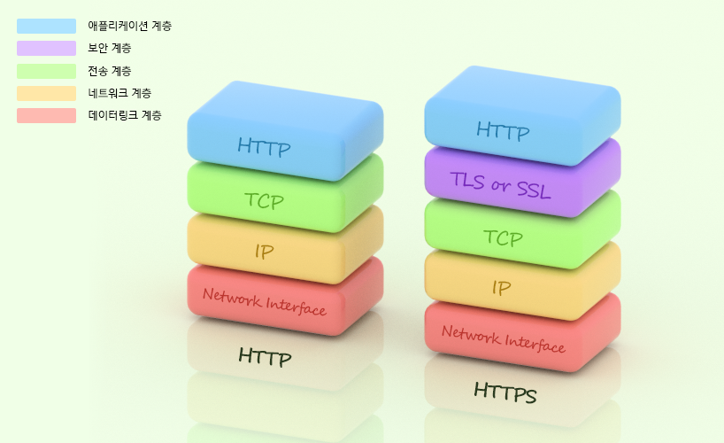

# Connection

* HTTP 는 어떻게 TCP 커넥션을 사용하는가
* TCP 커넥션의 지연, 병목, 막힘
* 병렬 커넥션, keep-alive 커넥션, 커넥션 파이프라인을 활용한 HTTP 최적화
* 커넥션 관리를 위해 따라야할 규칙들


# TCP 커넥션

모든 HTTP 통신은 **패킷 교환 네트워크 프로토콜들의 계층화된 집합**인 **TCP/IP** 를 통해 이루어집니다. 

일단 커넥션이 맺어지면, client-server 간에 주고받는 메시지들은 손실/손상 등이 발생하지 않습니다.

TCP 는 HTTP 에게 신뢰할 만한 통신 방식을 제공하며, 데이터들은 순서에 맞게 정확히 전달됩니다.

```
  http://www.sample.com:80/power-tools.html
```

1. 브라우저가 `www.sample.com` 호스트명 추출
2. 브라우저가 이 호스트명에 대한 IP 주소를 찾음 (ex. `202.43.78.3`)
3. 브라우저가 포트 번호(`80`) 을 얻음
4. 브라우저가 `202.43.78.3:80` 으로 **TCP 커넥션을 생성**
5. 브라우저가 서버로 HTTP `GET` 요청 메시지를 보냄
6. 브라우저가 서버에서 온 HTTP 응답 메시지를 읽음
7. 브라우저가 커넥션을 끊음

### TCP 스트림



TCP 는 *IP 패킷*(*IP 데이터그램*) 이라고 불리는 작은 조각을 통해 데이터를 전송합니다.

HTTP 에 보안기능을 더한 HTTPS 는 TLS 혹은 SSL 이라 불리기도 하며 HTTP 와 TCP 사이에 있는 암호화 계층입니다.

HTTP 가 메시지를 전달하고자 할 경우, 현재 연결되어있는 TCP 커넥션을 통하여 순서대로 데이터를 전달합니다.

TCP 는 *세그먼트*라는 단위로 데이터 스트림을 잘게 나누고, 세그먼트를 *IP 패킷*이라고 불리는 봉투에 담아서, 인터넷을 통해 데이터를 통해 데이터를 전달합니다.

각 TCP 세그먼트는 하나의 IP 주소에서 다른 IP 주소로 IP 패킷에 담겨 전달됩니다. **IP 패킷**에는 아래 데이터를 포함합니다.

* **IP 패킷 헤더** :: 발신지, 목적지 IP 주소, 크기, 기타 플래그 를 포함  (보통 20 바이트)
* **TCP 세그먼트 헤더** :: TCP 포트번호, TCP 제어 플래그, 데이터의 순서/무결경 검사를 위한 숫자 값(보통 20 바이트)
* TCP 데이터 조각 (0 혹은 그 이상의 바이트)

### TCP 커넥션 유지하기

컴퓨터는 항상 TCP 커넥션을 **여러 개** 가지고 있습니다. TCP 는 포트 번호를 통해서 이런 여러 개의 커넥션을 유지합니다. TCP 커넥션은 네 가지 값으로 식별합니다.

```
  <발신지 IP 주소, 발신지 포트, 수신지 IP 주소, 수신지 포트>
```

> ex ) 
> | 커넥션 | 발신지 IP 주소 | 발신지 포트 | 목적지 IP 주소  | 목적지 포트 |
> | ------ | -------------- | ----------- | --------------- | ----------- |
> | A      | `209.1.32.34`  | `2034`      | `204.62.128.58` | `4133`      |
> | B      | `209.1.32.35`  | `3227`      | `204.62.128.58` | `4140`      |
> | C      | `209.1.32.35`  | `3105`      | `207.25.71.25`  | `80`        |
> | D      | `209.1.32.89`  | `5100`      | `207.25.71.25`  | `80`        |


서로 다른 두 개의 TCP 커넥션은 네 가지 주소 구성요소의 값이 모두 같을 수 없습니다. (주소 구성 요소 일부가 같을 수는 있습니다)

* **같은 목적지 포트 번호**를 가리키는 커넥션 (C, D 모두 목적지 포트 `80`) 
* **같은 발신지 IP 주소**를 가리키는 커넥션 (B, C)
* **같은 목적지 IP 주소**를 가리키는 커넥션들 (A - B, C - D)
* 네 가지 커넥션 구성 요소를 모두 똑같이 가리키고 있는 커넥션은 있을 수 없습니다


### TCP 소켓 프로그래밍

운영체제는 TCP 커넥션의 생성과 관련된 여러 기능을 제공합니다. [소켓 API]() 는 HTTP 프로그래머에게 TCP 와 IP 의 세부 사항을 숨깁니다. 소켓 API 는 대부분의 운영체제와 프로그램 언어에서 사용할 수 있습니다.

소켓 API 를 사용하면, TCP 종단(Endpoint) 데이터 구조를 생성하고, 원격 서버의 TCP 종단에 그 종단 데이터 구조를 연결하여 데이터 스트림을 읽고 쓸 수 있습니다.

TCP API 는, 기본적인 네트워크 프로토콜의 핸드셰이킹, TCP 데이터 스트림과 IP 패킷 간의 분할 및 재조립에 대한 모든 세부사항을 외부로부터 숨깁니다.

> **진행 과정**
> 
> | 순서 | 클라이언트                         | 서버                      |
> | ---- | ---------------------------------- | ------------------------- |
> | 1    |                                    | 새로운 소켓 생성 (socket) |
> | 2    |                                    | `80` 포트로 소켓 묶음     |
> | 3    |                                    | 소켓 커넥션 허가 (listen) |
> | 4    |                                    | 커넥션 기다림 (accept)    |
> | 5    | IP 주소와 포트 얻음                |                           |
> | 6    | 새로운 소켓 생성 (socket)          |                           |
> | 7    | 서버의 `IP:포트` 로 연결 (connect) |                           |
> | 7    |                                    | 애플리케이션 커넥션 통지  |
> | 8    |                                    | 요청을 읽기 시작함 (read) |
> | 9    | 성공적 연결                        |                           |
> | 10   | HTTP 요청을 보냄 (write)           |                           |
> | 11   | HTTP 응답 대기 (read)              |                           |
> | 12   |                                    | HTTP 요청 메시지 처리     |
> | 13   | HTTP 응답 처리                     | HTTP 응답 보냄 (write)    |
> | 14   | 커넥션 닫기                        | 커넥션 닫기               |

-------
## TCP 성능

HTTP 는 TCP 바로 위의 계층이므로 **HTTP 트랜잭션의 성능은 그 아래 계층인 TCP 성능에 영향을 받습니다**.

###