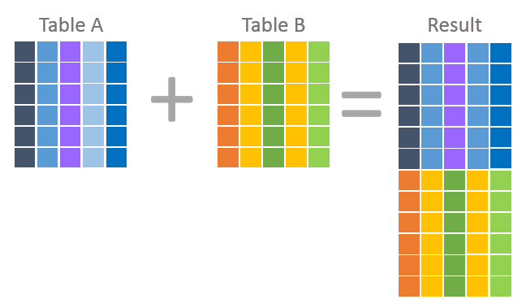
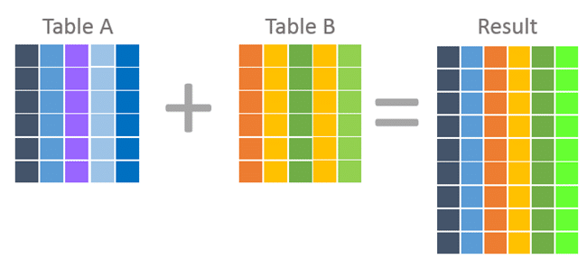

- [✏️ Qurey](#️-qurey)
    - [SELECT](#select)
    - [INSERT](#insert)
    - [UPDATE](#update)
    - [DELETE](#delete)
    - [ALTER](#alter)
    - [ORDER BY](#order-by)
    - [GROUP BY](#group-by)
  - [UNION & JOIN's difference](#union--joins-difference)
    - [UNION](#union)
    - [JOINS type](#joins-type)
    - [INNER JOIN](#inner-join)
    - [LEFT JOIN](#left-join)
    - [RIGHT JOIN](#right-join)
    - [FULL JOIN](#full-join)
    - [SELF JOIN](#self-join)
- [⚽ Function](#-function)
    - [1. Number function](#1-number-function)
    - [2. String Function](#2-string-function)
    - [3. Logic Function](#3-logic-function)
    - [4. Count Function](#4-count-function)
    - [5. Date Function](#5-date-function)
    - [6. Other function](#6-other-function)

# ✏️ Qurey
**Char => with '' | Int => without ''**

### SELECT 
``` sql
  SELECT * FROM <table name>;
  SELECT <column name 1>, <column name 2>, ... FROM <table name>;
```
### INSERT
``` sql
  INSERT INTO <table name> (column1, column2, column3, column4) VALUE ('value1', 'value2', value3, 'value4');
```
### UPDATE
``` sql
  UPDATE <table name> SET column1 = 'value1', column2 = 'value2'  WHERE column3 = 'value3' and column4 = 'value4';
```
### DELETE 
``` sql
  DELETE FROM <table name> WHERE column1 = 'value1';
```
### ALTER
``` sql
  ALTER TABLE <table name> add <column's new name> <type> <option>;   # add column into table
```
### ORDER BY
```sql
  SELECT <column1>, <column2> ... FROM <table name> ORDER BY <column1>, <column2>, ... ASC|DESC;
```
### GROUP BY
``` sql
  SELECT <column> FROM <table name> WHERE <condition> GROUP BY <column>;
```
## UNION & JOIN's difference

<div style="overflow:hidden">
    
    　  　  　  　
    
</div>

### UNION
``` sql
  SELECT <column1> FROM <table name> UNION SELECT <column1> FROM <table name> ... ;
  SELECT <column1> FROM <table name> UNION SELECT <column1> FROM <table name> ORDER BY <column1> DESC;
```
### JOINS type
<div style="overflow:hidden">
    
    
   
  
</div>
  
### INNER JOIN
``` sql
  SELECT <column> FROM <table name1> INNER JOIN <table name2> ON <table name1>.<column> = <table name2>.<column>;
```
### LEFT JOIN
``` sql
  SELECT <column> FROM <table name1> LEFT JOIN <table name2> ON <table name1>.<column> = <table name2>.<column>;
```
### RIGHT JOIN
``` sql
  SELECT <column> FROM <table name1> RIGHT JOIN <table name2> ON <table name1>.<column> = <table name2>.<column>;
```
### FULL JOIN
``` sql
  SELECT <column> FROM <table name1> FULL OUTER JOIN <table name2> ON <table name1>.<column> = <table name2>.<column> WHERE <condition>;
```
### SELF JOIN
``` sql
  SELECT <column> FROM <table name1>, <table name2> WHERE <condition>;
```
   
---------------------------------------------------------------------

# ⚽ Function

### 1. Number function

|function | Eng | Kor |
|------|---|---|
|`ABS(int)` | | 절대값 출력 |
|`CEILING(int)` |  | 값보다 큰 정수 중 가장 작은 수 |
|`FLOOR(int)`|  |값보다 작은 정수 중 가장 큰 수 - 실수를 무조건 버림(음수일 경우는 제외)|
|`ROUND(int, index)`||int를 소수점 이하 index(자릿수)에서 반올림 - (자릿수는 양수,0,음수를 가질 수 있음)|
|`TRUNCATE(int,index)`||int를 소수점 이하 index(자릿수)에서 버림|
|`POW(X,Y)` or `POWER(X,Y)`||X의 Y승|
|`MOD (numerator, denominator)`||numerator(분자)를 denominator(분모)로 나눈 나머지를 구한다.(연산자 %와 같음)|
|`GREATEST(num1,num2,num3...)`||주어진 수 중 제일 큰 수 리턴|
|`LEAST(num1,num2,num3...)`||주어진 수 중 제일 작은 수 리턴.|
|`INTERVAL(a,b,c,d.....)`||a(숫자)의 위치 반환|


### 2. String Function

|function | Eng | Kor |
|------|---|---|
|`ASCII(str)`||문자의 아스키 코드값 리턴|
|`CONCAT('str1','str2','str3'...)`||문자열들을 이어줌|
|`INSERT('str','from','length','new str')`||문자열(str)의 시작위치(from)부터 길이(length)만큼 새로운 문자열(new str)로 대치|
|`REPLACE('str1','str2','str3')`||str1 중 str2을 str3으로 변경|
|`INSTR('str1','str2')`||str1 중 str2의 위치값을 출력|
|`LEFT('str', len)`||str 중 왼쪽에서 len만큼을 추출|
|`RIGHT('str',len)`||str 중 오른쪽에서 len만큼을 추출|
|`MID('str', num1, num2)`||str 중 num1부터 num2개만큼 출력|
|`SUBSTRING('str', num1, num2)`||str 중 num1부터 num2개만큼 출력|
|`LTRIM('str')`||str 중 왼쪽의 공백 삭제|
|`RTRIM('str')`||str 중 오른쪽의 공백 삭제|
|`TRIM('str')`||양쪽 모두의 공백 삭제|
|`LCASE('str')` or `LOWER('str')`||소문자로 변경|
|`UCASE('str')` or `UPPER('str')`||대문자로 변경|
|`REVERSE('str')`||문자열을 반대로 나열|

### 3. Logic Function
|function | Eng | Kor |
|------|---|---|
|`IF(logic, true_value , false_value)`||논리식이 참이면 참일 때 값을 출력하고 논리식이 거짓이면 거짓일 때 출력한다.|
|`IFNULL(val1,val2)`||val1이 NULL 이면 val2로 대치하고, 그렇지 않으면 val1을 출력|

### 4. Count Function
|function | Eng | Kor |
|------|---|---|
|``COUNT(field_name)``||NULL 값이 아닌 레코드 수를 구함|
|`SUM(field_name)`||field_name의 합계를 구함|
|`AVG(field_name)`||각각의 그룹 안에서 field_name의 average를 구함|
|`MAX(field_name)`||max 값을 구함|
|`MIN(필드명)`||min 값을 구함|

### 5. Date Function
|function | Eng | Kor |
|------|---|---|
|`NOW()` or `SYSDATE()` or `CURRENT_TIMESTAMP()`||현재 날짜와 시간 출력|
|`CURDATE()` or `CURRENT_DATE()`||현재 날짜 출력|
|`CURTIME()` or `CURRENT_TIME()`||현재 시간 출력|
|`DATE_ADD(date,INTERVAL <standard_value>`)||날짜(date)에서 기준값(standard_value) 만큼 더하기 ※ 기준값 : YEAR, MONTH, DAY, HOUR, MINUTE, SECOND|
|`DATE_SUB(date,INTERVAL <standard_value>)`||날짜(date)에서 기준값(standard_value) 만큼 빼기 ※ 기준값 : YEAR, MONTH, DAY, HOUR, MINUTE, SECOND|
|`YEAR(date)`||날짜의 연도 출력|
|`MONTH(date)`||날짜의 월 출력|
|`MONTHNAME(date)`||날짜의 월을 영어로 출력|
|`DAYNAME(date)`||날짜의 요일일 영어로 출력|
|`DAYOFMONTH(date)`||날짜의 월별 일자 출력|
|`DAYOFWEEK(date)`||날짜의 주별 일자 출력(월요일(0),화요일(1)...일요일(6))|
|`WEEKDAY(date)`||날짜의 주별 일자 출력(월요일(0),화요일(1)...일요일(6))|
|`DAYOFYEAR(date)`||일년을 기준으로 한 날짜까지의 날 수|
|`WEEK(date)`||일년 중 몇 번째 주|
|`FROM_DAYS(day)`||00년 00월 00일부터 날 수 만큼 경과한 날의 날짜 출력|
|`TO_DAYS(date)`||00 년 00 월 00일 부터 날짜까지의 일자 수 출력|
|`DATE_FORMAT(date,'type')`||날짜를 형식에 맞게 출력|

**  date type  **
...


### 6. Other function
|function | Eng | Kor |
|------|---|---|
|`DATABASE()`||현재의 데이터베이스 이름출력|
|`PASSWORD('str')`||문자열을 암호화|
|`FORMAT(num, 0.00.. )`||num을 #,###,###.## 형식으로 출력|
