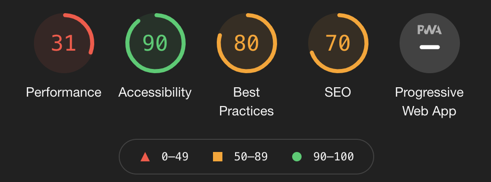

- [SEO, CSR, SSR](#seo-csr-ssr)
  - [SEO](#seo)
  - [CSR (Client Side Rendering)](#csr-client-side-rendering)
  - [SSR](#ssr)
- [SPA, MAP](#spa-map)
  - [마무리](#마무리)

# SEO, CSR, SSR

## SEO

* 검색 엔진 최적화 (Search Engine Optimization, SEO)
  * **사이트를 사용자에게 최적화시키는 것**
  * SEO란 검색 유저가 요구하는 사이트를 제작 및 운영하는 과정의 총칭

## CSR (Client Side Rendering)

1. 처음에 웹 서버에 요청할 때 데이터가 없는 문서를 반환합니다.

2. HTML 및 staic 파일들이 로드되면서, 데이터가 있을 경우 서버에 요청하고 화면에 보여줍니다.
3. 브라우저가 서버에 HTML 과 `static` 파일을 요청한 후 로드되면, 사용자의 상호 작용에 따라 js 를 통해 동적으로 렌더링을 실행합니다.

* **장점**
  * 첫 로딩에 HTML 과 `static` 파일을 다 받으면, 동적으로 빠르게 Rendering 하기 때문에 뛰어난 UX 를 자랑합니다.
  * 서버에 요청하는 수가 훨씬 적기 때문에 서버 부담이 적습니다.
* **단점**
  * 모든 HTML 과 `static` 파일이 로드 될 때 까지 기다려야합니다. (시간 소요 - 리소스를 Chunk 단위로 묶어서 요청할 때만 다운받는 식으로 완화시킬 수는 있지만 완벽하게 해결할 수는 없습니다.)
  * SEO (검색엔진 최적화) 문제가 발생할 수 있습니다. (검색엔진이 크롤링을 하는데 어려움)
  
## SSR

1. 완전하게 만들어진 HTML 파일을 받아오고 그 후에 랜더링합니다.
2. 웹 **서버에 요청할 때마다 Browser 새로고침**이 일어나고 **서버에 새로운 페이지에 대한 요청**을 하는 방식

* **장점**
  * 초기 로딩 속도가 빠르기 때문에 사용자가 컨텐츠를 빠르게 볼 수 있습니다.
  * 모든 검색엔진에 대한 SEO (검색 엔진 최적화) 가 가능합니다.
* **단점**
  * 매번 페이지를 요청할 때마다 새로고침 되기 때문에 사용자 UX 가 다소 떨어집니다.
  * 서버에 매번 요청을 하므로 트래픽, 서버 부하가 커집니다.

| 성능               | CSR                                                                                                                                 | SSR                                                                                                                                 |
| ------------------ | ----------------------------------------------------------------------------------------------------------------------------------- | ----------------------------------------------------------------------------------------------------------------------------------- |
| **과정**           |  |  |
| **초기 로딩 속도** | 모든 JS 을 다운 받아야 하기 때문에, **초기에는 오래걸린다**.                                                                        | CSR 에 비해 다운받는 파일이 많지 않아 **속도가 빠릅니다**.                                                                          |
| **서버 부담**      | data 요청이 있을 때만 서버에 요청하므로 **서버에 부담이 적습니다**.                                                                 | 서버와 잦은 응답(view 변경시마다 요청 실행)을 하기 때문에 **서버에 부담**이 생길 수 있습니다.                                       |
| **SEO**            | 맨 처음 HTML 파일이 비어있어, 크롤러가 **데이터를 수집할 수 없습니다.**(구글제외)                                                   | HTML 에 대한 정보가 처음에 포함되어있어 **데이터를 수집할 수 있습니다.**                                                            |

# SPA, MAP

* **SPA** :: Single Page Application
  * 단 하나의 페이지로 이루어진 앱
  * 하나의 HTML을 기반으로 js 를 이용해 동적으로 이리저리 컨텐츠를 바꾸는 방식의 웹 애플리케이션입니다.
  * 서버로부터 처음에만 페이지를 받아오고, 이후에는 동적으로 DOM 을 구성하여 Rendering 되는 화면이 바뀌게 됩니다.(CSR 방식 채택)
  
* **MPA** :: Multiple page Application
  * 화면마다 HTML 파일이 존재하고, 사용자가 그 화면을 요청할 때마다, 웹 서버가 필요한 데이터와 HTML 로 파싱해서 보여주는 방식의 웹 어플리케이션
  * 동적이지 않은 페이지를 상황에 맞게 클라이언트에게 보여줍니다. (SSR 방식 채택)

SPA, MPA 는 페이지를 여러개 사용하느냐, 아니냐에 차이입니다. CSR과 SSR 은 랜더링을 어디서 하느냐의 차이입니다.

둘은 비교될 수 없습니다.

**SPA 에서 SSR 구성하는 방법**은 다양한 라이브러리를 사용하거나, 언어가 다를경우에도 사용할 수 있습니다.

## 마무리

SSR 과 CSR 을 적절히 사용해야합니다. UX 에 지장이 가지 않는 선에서 페이지를 나누어 적절히 활용해야합니다.
